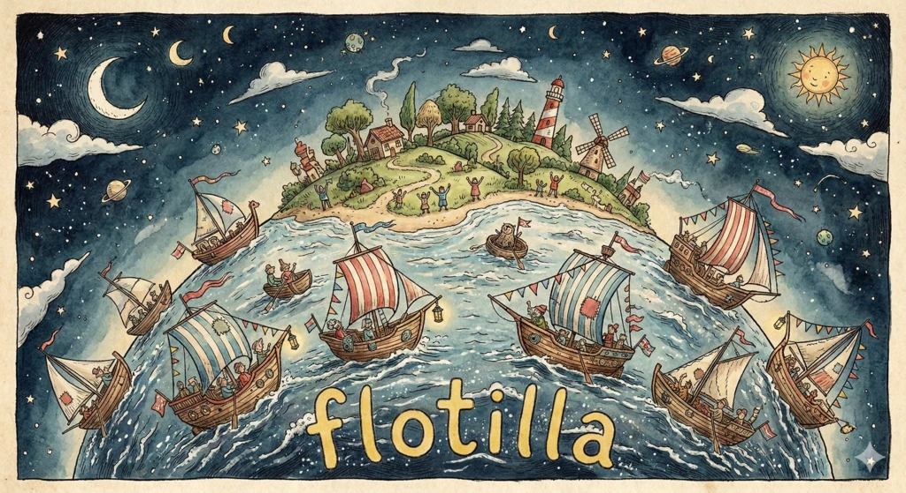

# flotilla

[](https://github.com/rjwittams/flotilla/actions/workflows/ci.yml)
[](https://rjwittams.github.io/flotilla/coverage/)

Development fleet management. Agents, branches, PRs, and workspaces across every repo in one view.




Flotilla in cmux: Each row correlates a branch with its PR, agent sessions, and workspace automatically.

## Integrations

Available tools are auto-detected from your environment, with configurable overrides.

| Category | Focus | WIP | Future |
|----------|-------|-----|--------|
| Version control | [git](https://git-scm.com/) | | [jj](https://jj-vcs.github.io/jj/latest/) (#45) |
| Checkouts | [git worktrees](https://git-scm.com/docs/git-worktree), [worktrunk](https://worktrunk.dev/) | | jj workspaces (#45), local clones (#44) |
| Code review | [GitHub](https://github.com/) PRs | | [GitLab](https://gitlab.com/) MRs (#49) |
| Issue tracking | [GitHub Issues](https://github.com/features/issues) | | [Linear](https://linear.app/) (#51), [Jira](https://www.atlassian.com/software/jira) (#50) |
| Cloud coding agents | [Claude Code](https://docs.anthropic.com/en/docs/claude-code) sessions | | [Codex](https://openai.com/index/introducing-codex/) (#52), others (#53) |
| Workspace managers | [cmux](https://github.com/rjwittams/cmux) | [tmux](https://tmux.github.io/) (#54), [zellij](https://zellij.dev/) (#55) | |
| AI delegation (e.g branch naming) | Claude Code | | LLM APIs (#56), [ollama](https://ollama.com/) (#56) |

## How it works

- **Auto-discovery**: detects tools from your environment, with configurable overrides.
- **Providers**: Provider implementations collect fragments of data and surface available actions. Multiple providers of the same type can coexist (e.g. GitHub Issues alongside Linear).
- **Correlation**: Fragments sharing identity are transitively merged into unified work items. One row per unit of work.
- **Workspace templates**: `.flotilla/workspace.yaml` defines pane layouts. One keystroke creates a multi-agent workspace. Native layouts (e.g KDL for Zellij) to come.
- **Multi-repo**: each repo is a tab with its own detected providers.

## Quickstart

```
cargo install --git https://github.com/rjwittams/flotilla
cd your-repo
flotilla
```

Or from source:

```
git clone https://github.com/rjwittams/flotilla
cd flotilla
cargo run -- --repo-root /path/to/your/repo
```

Repo root is auto-detected from the current directory if omitted. Multiple repos can be managed as tabs.

## Future direction

- Web dashboard — alternative/in addition to TUI (#36)
- Persistent sessions (#32)
- Multi-host coordination — coordinate across your development hosts with a unified view. Hand off sessions to hosts with appropriate resources. (#33)
- User-oriented filtering for large team repos (#34)
- Agent integrations — expose fleet functionality to agents, e.g. transferring work items/agent sessions to a host with required resources, like a local GPU or iOS simulator. (#35)

## Documentation

- [Keybindings](docs/keybindings.md)
- [Workspace templates](docs/workspace-templates.md)
- [Configuration](docs/configuration.md)
- [Architecture](docs/architecture/)

---

This project makes extensive use of generative AI — including artwork. 
